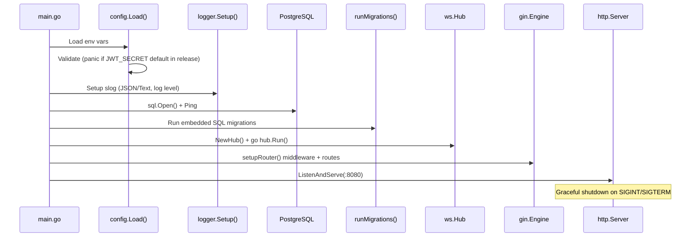
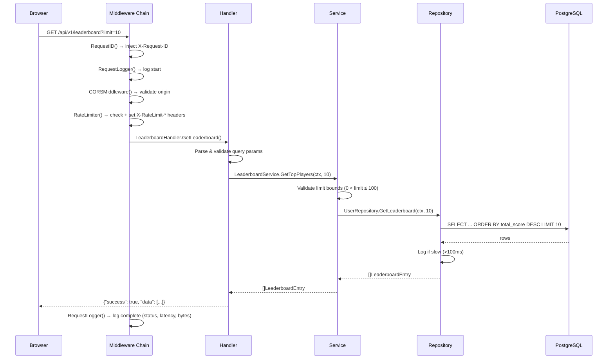
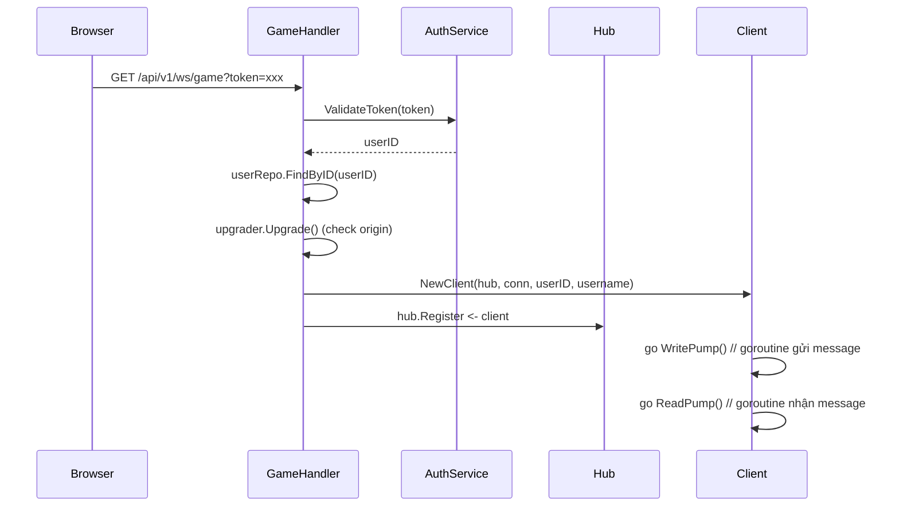
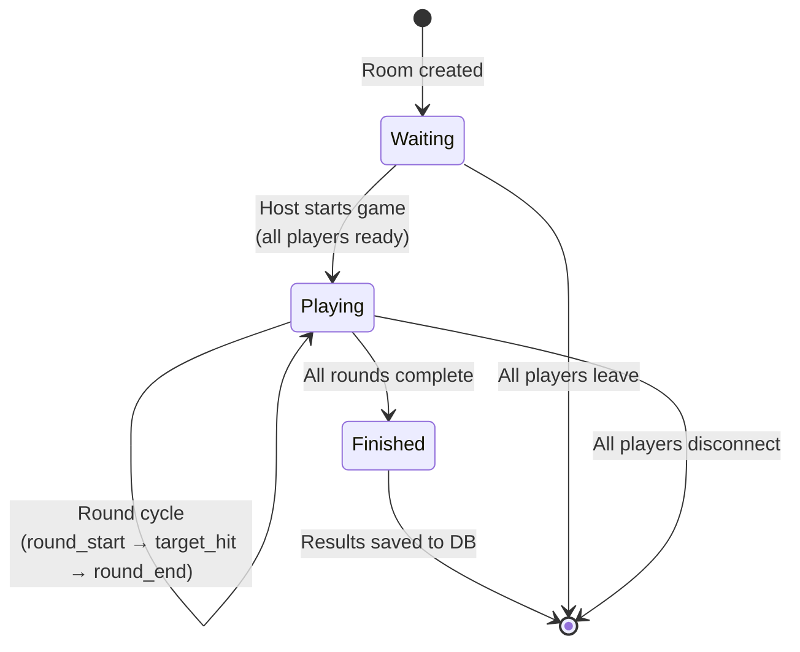
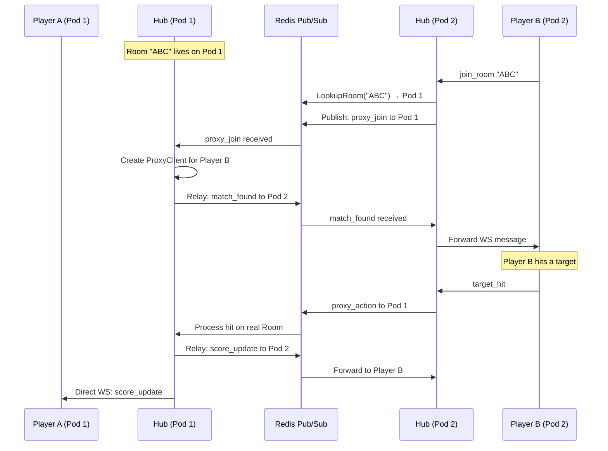

# 🔄 Backend Flow — Lingo Sniper

> Chi tiết luồng xử lý backend / Detailed backend request lifecycle

## Layered Architecture

```
cmd/server/main.go          ← Entry point, DI, server setup
├── internal/middleware/     ← Cross-cutting concerns (CORS, auth, rate limit, logging)
├── internal/handler/        ← HTTP transport layer (request parsing, response formatting)
├── internal/service/        ← Business logic (interfaces, validation)
├── internal/repository/     ← Data access (SQL queries, DB interaction)
├── internal/model/          ← Domain models (User, GameSession, Vocabulary)
├── internal/config/         ← Environment configuration
├── internal/ws/             ← WebSocket engine (Hub, Room, Client, Matchmaker)
├── internal/migration/      ← SQL migration files (embedded via go:embed)
└── pkg/                     ← Shared packages (logger, response)
```

## Startup Flow / Luồng khởi động



## REST API Request Lifecycle / Vòng đời request



## Middleware Chain / Chuỗi Middleware

Thứ tự thực thi (trên xuống) / Execution order (top to bottom):

| # | Middleware | Chức năng / Purpose |
|---|-----------|---------------------|
| 1 | `gin.Recovery()` | Recover panics, trả 500 thay vì crash |
| 2 | `RequestID()` | Inject unique ID vào context + response header |
| 3 | `RequestLogger()` | Log method, path, status, latency, bytes, request_id |
| 4 | `CORSMiddleware(origins)` | Validate browser origin từ config |
| 5 | `RateLimiter(200/min)` | IP-based rate limiting + RFC 6585 headers |
| 6 | `AuthMiddleware()` | JWT validation (chỉ cho protected routes) |

## WebSocket Game Flow / Luồng game real-time

### Connection Establishment / Thiết lập kết nối



### Game State Machine / Máy trạng thái game



### Room Lifecycle / Vòng đời phòng chơi

```
1. CREATE_ROOM → Room created (code: "ABC123") → Host joins
2. JOIN_ROOM   → Player joins by code | Matchmaker auto-pairs
3. READY       → Each player marks ready
4. START_GAME  → Host triggers (solo: auto-start)
5. COUNTDOWN   → 3...2...1... broadcast
6. ROUND_START → Question + targets sent to all players
7. TARGET_HIT  → Player clicks → score calculated → broadcast update
8. ROUND_END   → After timeout → live leaderboard shown
9. → Repeat steps 6-8 for all rounds
10. GAME_OVER  → Final ranking → results saved to DB → stats updated
```

### Cross-Instance Flow (Redis Pub/Sub) / Đồng bộ đa pod



## Logging Strategy / Chiến lược logging

Mỗi layer có component tag riêng. Khi incident xảy ra, search bằng `request_id` để thấy toàn bộ call chain:

```
Layer           │ Component Tag         │ Log Level
────────────────┼───────────────────────┼──────────────────
Middleware      │ HTTP                  │ INFO (all requests)
Handler         │ HANDLER.Auth/Game/... │ WARN (client err), ERROR (server err)
Service         │ SVC.Auth/Vocab/...    │ INFO (lifecycle), ERROR (failures)
Repository      │ REPO.User/Game/...    │ ERROR (query fail), WARN (slow >100ms)
WebSocket       │ WS                    │ INFO (connect/disconnect), ERROR (upgrade fail)
Redis           │ REDIS                 │ INFO (sync events), ERROR (connection)
```

## Error Handling Pattern / Quy ước xử lý lỗi

```go
// Repository: log error + return
if err != nil {
    r.log.Error("find user failed", "op", "FindByID", "user_id", id, "err", err)
    return nil, err
}

// Service: log context + return
if err != nil {
    s.log.Error("get top players failed", "op", "GetTopPlayers", "err", err)
    return nil, err
}

// Handler: log + return generic message to client (NEVER expose internal errors)
if err != nil {
    h.log.Error("get leaderboard failed", "err", err, "request_id", reqID)
    response.InternalError(c, "failed to fetch leaderboard") // Generic!
    return
}
```

> **Nguyên tắc / Principle**: Internal errors NEVER leak to client. Client chỉ nhận generic error message. Detail nằm trong structured logs.
