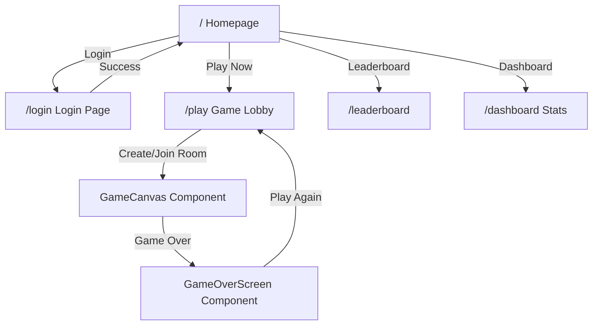
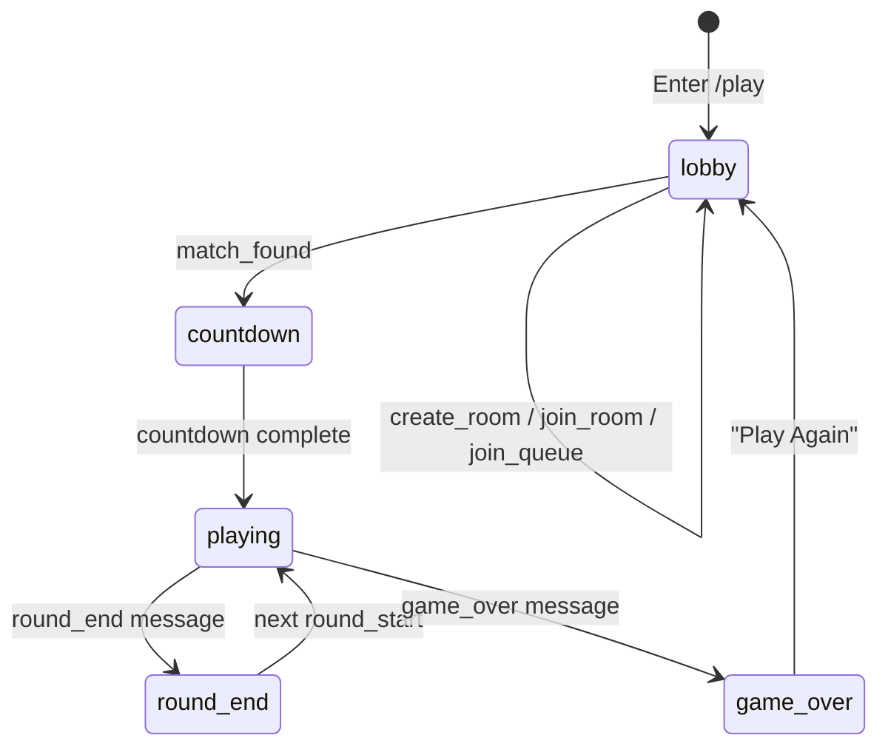

# 🎨 Frontend Flow — Lingo Sniper

> Chi tiết luồng xử lý frontend / Detailed frontend architecture

## Project Structure / Cấu trúc dự án

```
frontend/src/
├── app/                    ← Next.js App Router (pages)
│   ├── layout.tsx          ← Root layout (Header, global providers)
│   ├── page.tsx            ← Homepage (/)
│   ├── login/page.tsx      ← Login page (/login)
│   ├── play/page.tsx       ← Game lobby + canvas (/play)
│   ├── leaderboard/page.tsx← Leaderboard (/leaderboard)
│   └── dashboard/page.tsx  ← User dashboard (/dashboard)
├── components/
│   ├── layout/Header.tsx   ← Navigation header
│   └── game/
│       ├── GameCanvas.tsx  ← Main game renderer (targets, timer)
│       ├── Countdown.tsx   ← 3-2-1 countdown overlay
│       ├── GameOverScreen.tsx ← Results + stats display
│       └── LiveLeaderboard.tsx ← Real-time score board
├── hooks/
│   ├── useAuth.tsx         ← Auth context (login, register, token)
│   ├── useGame.ts          ← Game state management
│   └── useWebSocket.ts     ← WebSocket connection manager
├── lib/
│   └── api.ts              ← Axios instance + interceptors
└── styles/
    └── globals.css         ← Tailwind + cyberpunk theme
```

## Page Flow / Luồng trang



## Core Hooks / Các hook chính

### `useAuth` — Authentication Context

```typescript
// Cung cấp / Provides:
{
  user,           // Current user object
  token,          // JWT token
  isLoading,      // Auth state loading
  login(email, password),    // Login function
  register(username, email, password), // Register function
  logout()        // Clear token + redirect
}
```

**Luồng / Flow:**
1. App load → check `localStorage` for token
2. If token exists → validate by calling API → set user
3. Login/Register → call API → store token → set user
4. Logout → clear token → redirect to `/`
5. Token auto-attached to all API calls via axios interceptor

### `useWebSocket` — Connection Manager

```typescript
// Cung cấp / Provides:
{
  isConnected,    // Connection status
  sendMessage(msg), // Send WS message
  lastMessage,    // Latest received message
  connect(token), // Establish connection
  disconnect()    // Close connection
}
```

**Luồng / Flow:**
1. User enters `/play` → `connect(token)` called
2. WebSocket URL: `wss://lingosniper.lol/api/v1/ws/game?token=xxx`
3. On message → parse JSON → update `lastMessage`
4. Auto-reconnect on disconnect (with backoff)
5. Connection timeout → show error UI
6. Ping/pong heartbeat (30s interval)

### `useGame` — Game State Machine

```typescript
// Cung cấp / Provides:
{
  gameState,      // "lobby" | "countdown" | "playing" | "round_end" | "game_over"
  roomCode,       // Room code for sharing
  players,        // List of players in room
  scores,         // Current scores
  currentRound,   // Round info (question, targets)
  isHost,         // Whether current user is host
  hostUsername,    // Current room host name
  ranking,        // Final game ranking
  // Actions:
  createRoom(language, level),
  joinRoom(code),
  joinQueue(language, level, mode),
  setReady(),
  startGame(),
  hitTarget(targetId, reactionMs),
  leaveRoom()
}
```

**State Transitions / Chuyển trạng thái:**



## Component Architecture / Kiến trúc component

### GameCanvas

Render logic chính:
1. **Waiting state**: Show lobby UI (player list, room code, ready button)
2. **Playing state**: Render targets at (x, y) positions on canvas
3. **Target click**: Calculate reaction time → send `target_hit` message
4. **Timer**: Visual countdown bar for each round
5. **Animations**: Particle effects on hit, scanline overlay, ambient orbs

### LiveLeaderboard

- Nhận data từ `live_leaderboard` WS message mỗi round
- Sort by score descending
- Highlight current user
- Animate rank changes

### GameOverScreen

- Hiển thị final ranking, winner announcement
- Stats: total rounds, avg reaction, accuracy
- "Play Again" button → reset state → return to lobby

## API Layer / Tầng API

```typescript
// lib/api.ts
const api = axios.create({
  baseURL: process.env.NEXT_PUBLIC_API_URL, // http://localhost/api
});

// Auto-attach JWT token
api.interceptors.request.use((config) => {
  const token = localStorage.getItem("token");
  if (token) config.headers.Authorization = `Bearer ${token}`;
  return config;
});
```

### REST Endpoints Used

| Method | Endpoint | Hook | Mục đích / Purpose |
|--------|---------|------|---------------------|
| POST | `/api/v1/auth/register` | useAuth | Đăng ký |
| POST | `/api/v1/auth/login` | useAuth | Đăng nhập |
| GET | `/api/v1/leaderboard` | fetch | Bảng xếp hạng |
| GET | `/api/v1/online` | fetch | Số người online |
| GET | `/api/v1/stats/me` | useAuth | Thống kê cá nhân |
| WS | `/api/v1/ws/game` | useWebSocket | Real-time game |

## Styling Architecture / Kiến trúc CSS

- **Tailwind CSS v4** (CSS-first config)
- **Cyberpunk Theme**: Custom CSS variables for neon colors, glassmorphism
- **Animations**: Scanlines, particle effects, ambient orbs
- **Accessibility**: `prefers-reduced-motion` respected via `motion-safe:` prefix
- **Focus management**: `focus-visible` states on all interactive elements

## Performance Considerations / Cân nhắc hiệu năng

| Area | Technique | Lý do / Why |
|------|----------|-------------|
| **SSR** | Next.js App Router | SEO + faster first paint |
| **Bundle** | Standalone output | Smaller Docker image |
| **WS reconnect** | Exponential backoff | Avoid thundering herd on server restart |
| **State updates** | Local state → WS → re-render | No unnecessary API calls during game |
| **Images** | No external images (CSS-only effects) | Zero network requests for UI assets |
