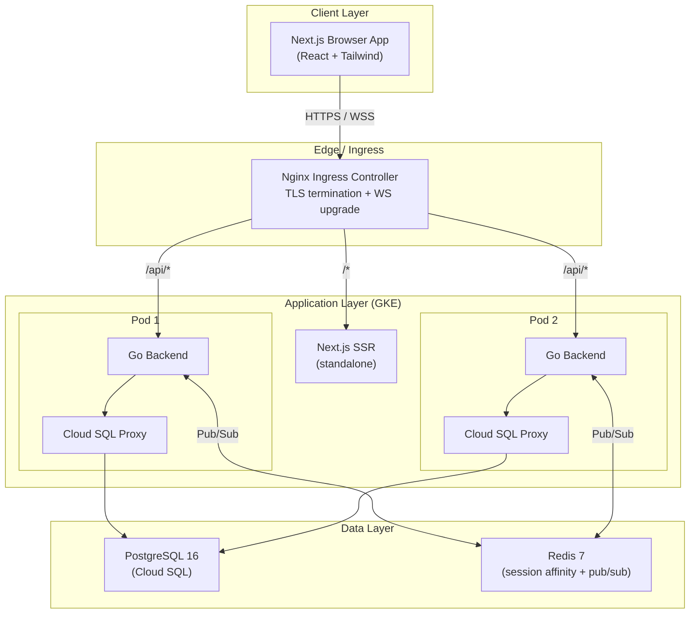
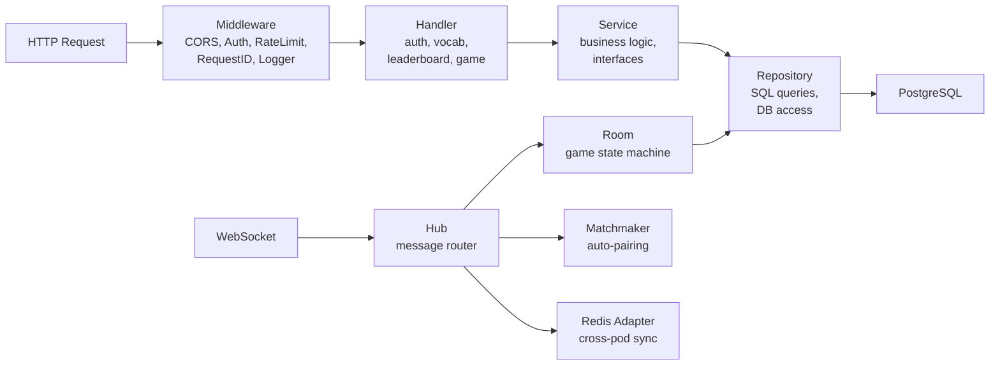
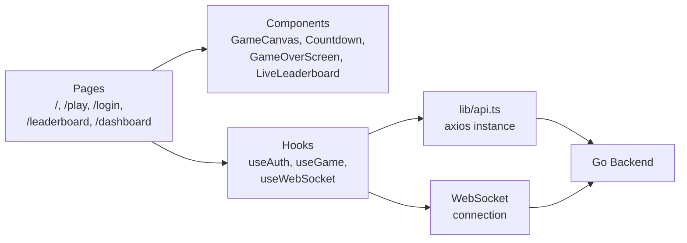
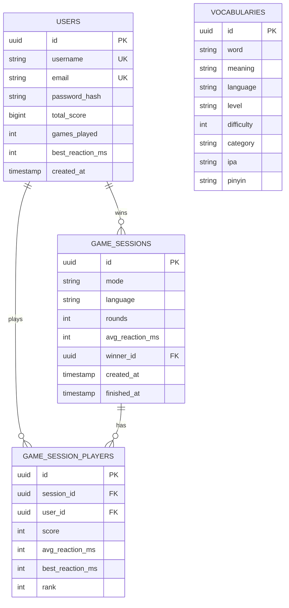

# 🏗️ System Design — Lingo Sniper

> Tổng quan kiến trúc hệ thống / System architecture overview

## Architecture Diagram



## Tech Stack

| Layer | Technology | Lý do chọn / Why |
|-------|-----------|-------------------|
| **Frontend** | Next.js 15 + React 19 + Tailwind CSS v4 | SSR, file-based routing, rapid UI dev |
| **Backend** | Go 1.25 + Gin framework | High concurrency, low latency for real-time game |
| **WebSocket** | gorilla/websocket + Redis Pub/Sub | Real-time bidirectional communication, multi-pod sync |
| **Database** | PostgreSQL 16 (Cloud SQL) | Relational data, ACID, leaderboard queries |
| **Cache/PubSub** | Redis 7 | Cross-pod WS message relay, session data |
| **Container** | Docker + GKE Autopilot | Managed K8s, auto-scaling |
| **CI/CD** | GitHub Actions + WIF | Keyless auth to GCP, auto-deploy on push to `main` |
| **Ingress** | Nginx Ingress + cert-manager | TLS via Let's Encrypt, WebSocket upgrade support |

## Backend Architecture (Layered)



> **Nguyên tắc / Principle**: Mỗi layer chỉ giao tiếp với layer ngay dưới nó. Handler không truy cập trực tiếp Repository. / Each layer only communicates with the layer directly below it.

## Frontend Architecture



## Data Flow

### REST API Flow (Ví dụ: GET /api/v1/leaderboard)

```
Browser → Nginx → [RequestID] → [Logger] → [CORS] → [RateLimit]
        → LeaderboardHandler.GetLeaderboard()
        → LeaderboardService.GetTopPlayers()
        → UserRepository.GetLeaderboard()
        → PostgreSQL → Response
```

### WebSocket Flow (Ví dụ: Player joins game)

```
Browser → WSS upgrade → GameHandler.HandleWebSocket()
        → JWT validation → User lookup
        → Client created → Hub.Register
        → Client sends "join_queue"
        → Hub.HandleMessage() → Matchmaker.Enqueue()
        → Match found → Room created → "match_found" sent to both players
```

## Database Schema



## Deployment Topology

```
GKE Cluster (asia-southeast1-a)
├── Namespace: lingo-sniper
│   ├── Deployment: backend (2 replicas)
│   │   ├── Container: go-backend (:8080)
│   │   └── Sidecar: cloud-sql-proxy
│   ├── Deployment: frontend (1 replica)
│   │   └── Container: nextjs (:3000)
│   ├── Deployment: redis (1 replica)
│   │   └── Container: redis (:6379)
│   ├── Service: backend (ClusterIP)
│   ├── Service: frontend (ClusterIP)
│   ├── Service: redis (ClusterIP)
│   └── Ingress: nginx + cert-manager (Let's Encrypt)
└── Domain: lingosniper.lol
```

## Key Design Decisions

| Decision | Choice | Alternative Considered | Lý do / Reason |
|----------|--------|----------------------|----------------|
| Monolith vs Microservice | **Monolith** | Microservice | Small team, game logic tightly coupled |
| WS library | **gorilla/websocket** | nhooyr/websocket | Battle-tested, simpler API |
| Multi-pod WS sync | **Redis Pub/Sub** | NATS, Kafka | Already using Redis, sufficient for scale |
| Auth strategy | **JWT stateless** | Session-based | Horizontal scaling, no shared session store |
| DB migration | **Embedded go:embed** | Flyway, golang-migrate CLI | Zero external dependencies at runtime |
