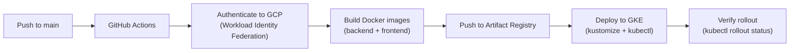

# 📘 Learning Guide: CI/CD with GitHub Actions

> Hướng dẫn thiết lập CI/CD pipeline / CI/CD setup and management guide

## Prerequisites
- Git basics (commit, push, branch, merge)
- Docker basics

---

## 1. Pipeline Overview / Tổng quan pipeline



### Trigger
```yaml
on:
  push:
    branches:
      - main  # CHỈ trigger khi push vào main
```

---

## 2. Workload Identity Federation (WIF)

### Vấn đề / Problem
- Cần cho GitHub Actions access vào GCP (push images, deploy to GKE)
- **KHÔNG** muốn lưu service account key file (bảo mật kém)

### Giải pháp / Solution: Keyless Auth
```yaml
- name: Authenticate to Google Cloud
  uses: google-github-actions/auth@v2
  with:
    token_format: 'access_token'
    workload_identity_provider: 'projects/.../workloadIdentityPools/github-pool/providers/github-provider'
    service_account: 'github-actions@lingo-sniper-prod.iam.gserviceaccount.com'
```

**Cách hoạt động / How it works:**
1. GitHub generates OIDC token (chứng minh "tôi là repo tinhuynh1/language-arena")
2. GCP WIF validates token → maps to service account
3. Service account có quyền push images + deploy to GKE
4. **Không có key file nào** — zero secret management!

### Setup Steps
```bash
# 1. Tạo Workload Identity Pool
gcloud iam workload-identity-pools create github-pool --location=global

# 2. Tạo Provider (liên kết GitHub OIDC)
gcloud iam workload-identity-pools providers create-oidc github-provider \
  --location=global --workload-identity-pool=github-pool \
  --issuer-uri="https://token.actions.githubusercontent.com" \
  --attribute-mapping="google.subject=assertion.sub,attribute.repository=assertion.repository"

# 3. Bind service account
gcloud iam service-accounts add-iam-policy-binding github-actions@PROJECT.iam.gserviceaccount.com \
  --role="roles/iam.workloadIdentityUser" \
  --member="principalSet://iam.googleapis.com/projects/.../locations/global/workloadIdentityPools/github-pool/attribute.repository/tinhuynh1/language-arena"
```

---

## 3. Build & Push Images

```yaml
- name: Build and Push Backend
  run: |
    docker buildx build --platform linux/amd64 \
      -t $GAR/backend:${{ github.sha }} ./backend
    docker push $GAR/backend:${{ github.sha }}

- name: Build and Push Frontend
  run: |
    docker buildx build --platform linux/amd64 \
      -t $GAR/frontend:${{ github.sha }} ./frontend
    docker push $GAR/frontend:${{ github.sha }}
```

**Key points:**
- `--platform linux/amd64`: Vì GKE chạy Linux (dù dev trên Mac ARM)
- Tag bằng `github.sha`: Mỗi commit = 1 image tag unique
- Push lên Google Artifact Registry (asia-southeast1)

---

## 4. Deploy to GKE

```yaml
- name: Set up Kustomize
  run: curl -s "https://...install_kustomize.sh" | bash

- name: Deploy to GKE
  run: |
    cd k8s
    # Thay image tag bằng commit SHA
    kustomize edit set image .../backend=.../backend:${{ github.sha }}
    kustomize edit set image .../frontend=.../frontend:${{ github.sha }}

    # Apply to cluster
    kustomize build . | kubectl apply -f -

    # Đợi pods ổn định
    kubectl rollout status deployment/backend -n lingo-sniper --timeout=300s
    kubectl rollout status deployment/frontend -n lingo-sniper --timeout=300s
```

**Tại sao Kustomize? / Why Kustomize?**
- Base manifests (`deployment.yaml`) giữ nguyên
- Kustomize chỉ overlay image tag mới
- Không cần template engine (như Helm) cho project nhỏ

---

## 5. Common Issues & Tips

| Issue | Nguyên nhân / Cause | Fix |
|-------|---------------------|-----|
| CI passes but old UI on prod | `kubectl apply` local ghi đè image tag về `:latest` | Luôn dùng CI deploy, không `kubectl apply` thủ công |
| Build fails on `linux/amd64` | Mac ARM cross-compile issue | Ensure `--platform linux/amd64` in buildx |
| Auth fails in CI | WIF misconfigured | Check `permissions: id-token: write` in workflow |
| Rollout timeout | Pod crash or readiness fail | `kubectl describe pod` → check logs |

### Bài tập / Exercises
1. ✏️ Đọc `.github/workflows/deploy.yml` → vẽ flowchart mỗi step
2. ✏️ Manually trigger workflow: push empty commit → xem CI chạy
3. ✏️ Thêm 1 step "Run Tests" trước Build → `go test ./...`
4. ✏️ Giải thích tại sao `kustomize edit set image` cần thiết
