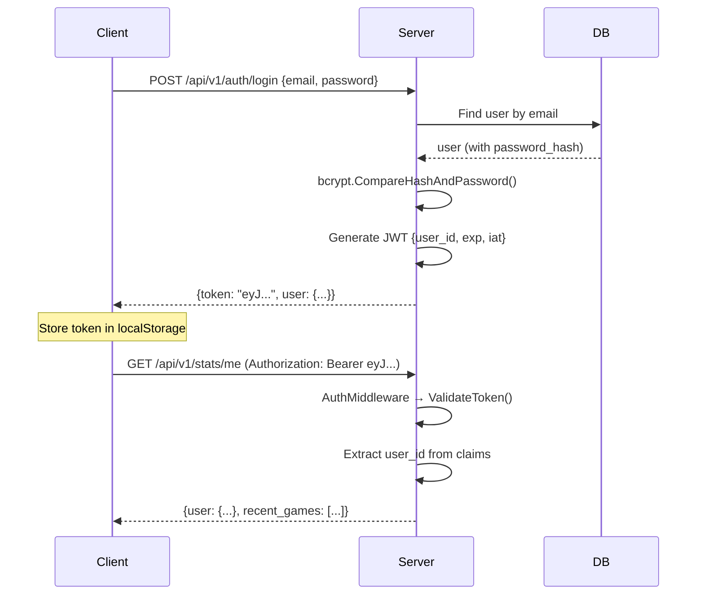

# 📘 Learning Guide: Security

> Hướng dẫn về bảo mật ứng dụng / Application security guide

## Prerequisites
- HTTP basics (headers, cookies, HTTPS)
- Basic cryptography concepts (hashing, encryption)

---

## 1. Authentication — JWT (JSON Web Token)

### How it works in this project



### JWT Structure
```
Header.Payload.Signature

Header:  {"alg": "HS256", "typ": "JWT"}
Payload: {"user_id": "abc-123", "exp": 1713600000, "iat": 1713513600}
Signature: HMAC-SHA256(header.payload, JWT_SECRET)
```

### Files involved
- `service/auth_service.go` → `generateToken()`, `ValidateToken()`
- `middleware/auth.go` → `AuthMiddleware()` extracts token from header
- `config/config.go` → `JWT_SECRET` from env, validated at startup

### Security measures / Biện pháp bảo mật
- ✅ `JWT_SECRET` validated at startup — panics if default value in release mode
- ✅ Token expiration (24h by default)
- ✅ HMAC-SHA256 signing (secret-based, not public key)
- ⚠️ Token stored in localStorage (XSS risk — consider httpOnly cookies for production)

---

## 2. Password Security — bcrypt

```go
// Registration: hash password
hash, err := bcrypt.GenerateFromPassword([]byte(password), bcrypt.DefaultCost)
// → "$2a$10$..." (60 chars, includes salt)

// Login: compare
err := bcrypt.CompareHashAndPassword([]byte(storedHash), []byte(inputPassword))
```

**Tại sao bcrypt? / Why bcrypt?**
- Built-in salt (không cần quản lý salt riêng)
- Adjustable cost factor (slow = harder to brute force)
- Industry standard cho password hashing

**⛔ KHÔNG BAO GIỜ / NEVER:**
- Store plaintext passwords
- Use MD5/SHA256 for passwords (too fast → easy brute force)
- Log passwords in any form

---

## 3. CORS (Cross-Origin Resource Sharing)

### Vấn đề / Problem
Browser blocks cross-origin requests by default. Frontend (`lingosniper.lol`) cần gọi API backend.

### Solution trong dự án
```go
// middleware/cors.go
func CORSMiddleware(allowedOrigins []string) gin.HandlerFunc {
    return cors.New(cors.Config{
        AllowOrigins:     allowedOrigins,  // From CORS_ORIGINS env var
        AllowCredentials: true,
        AllowHeaders:     []string{"Authorization", "Content-Type", "Upgrade"},
    })
}
```

```bash
# Production env
CORS_ORIGINS=https://lingosniper.lol
```

**⛔ KHÔNG BAO GIỜ**: `AllowAllOrigins: true` trong production

---

## 4. WebSocket Origin Check

```go
// handler/game_handler.go
CheckOrigin: func(r *http.Request) bool {
    origin := r.Header.Get("Origin")
    if origin == "" {
        return true  // Non-browser clients (curl, etc.)
    }
    _, ok := originSet[origin]  // Check against ALLOWED_WS_ORIGINS
    return ok
},
```

**Tại sao cần? / Why needed?**
- Without check: any website can connect to your WS endpoint
- CSRF-like attack: malicious site opens WS to your server using user's cookies/token

---

## 5. Rate Limiting

```go
// middleware/ratelimit.go
rateLimiter := NewRateLimiter(200, time.Minute)
// → 200 requests per IP per minute

// RFC 6585 headers in every response:
X-RateLimit-Limit: 200
X-RateLimit-Remaining: 195
X-RateLimit-Reset: 1713600060
```

**Limitations / Hạn chế:**
- In-memory → resets on pod restart
- Per-pod → user có thể hit 200 * N (N = number of pods)
- Production improvement: use Redis-based rate limiting

---

## 6. Infrastructure Security

| Area | Current Implementation | Improvement Idea |
|------|----------------------|------------------|
| **Secrets** | K8s Secrets | → GCP Secret Manager |
| **DB access** | Cloud SQL Proxy + IAM | ✅ Best practice |
| **TLS** | cert-manager + Let's Encrypt | ✅ Auto-renewal |
| **Network** | ClusterIP services (internal only) | ✅ Not exposed externally |
| **Container** | `runAsNonRoot` on proxy | → Apply to all containers |
| **Dependencies** | Manual updates | → Dependabot / Renovate |

### Config Validation
```go
// config.go — startup validation
func (c *Config) validate() {
    if os.Getenv("GIN_MODE") == "release" && c.JWT.Secret == "dev-secret-change-in-prod" {
        slog.Error("FATAL: JWT_SECRET must be changed in production")
        os.Exit(1)  // Hard fail — do NOT start with default secret
    }
}
```

---

## 7. Security Checklist / Checklist bảo mật

- [x] Passwords hashed with bcrypt
- [x] JWT with configurable expiration
- [x] JWT_SECRET validated at startup (release mode)
- [x] CORS restricted to specific origins
- [x] WebSocket origin validation
- [x] Rate limiting with headers
- [x] Cloud SQL Proxy (no public DB exposure)
- [x] TLS everywhere (Let's Encrypt)
- [x] No secrets in code (env vars / K8s secrets)
- [x] Internal errors never leaked to client
- [ ] 🔲 HTTP-only cookies for tokens (vs localStorage)
- [ ] 🔲 Redis-based rate limiting
- [ ] 🔲 Input sanitization (SQL injection prevention beyond parameterized queries)
- [ ] 🔲 Security headers (CSP, HSTS, X-Frame-Options)

### Bài tập / Exercises
1. ✏️ Decode JWT token (https://jwt.io/) → verify payload structure
2. ✏️ Thử request API từ domain khác → CORS block thế nào?
3. ✏️ Giải thích tại sao bcrypt cost factor quan trọng
4. ✏️ Nếu JWT_SECRET bị lộ → cần làm gì?
